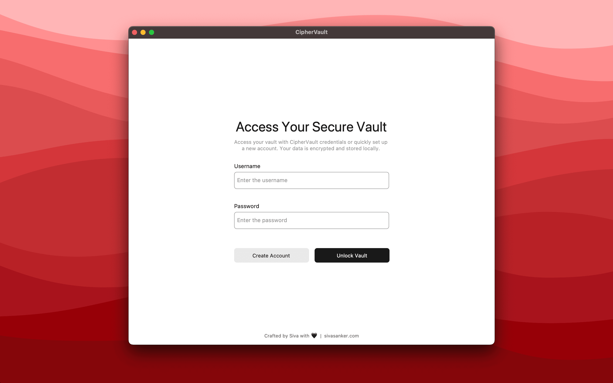
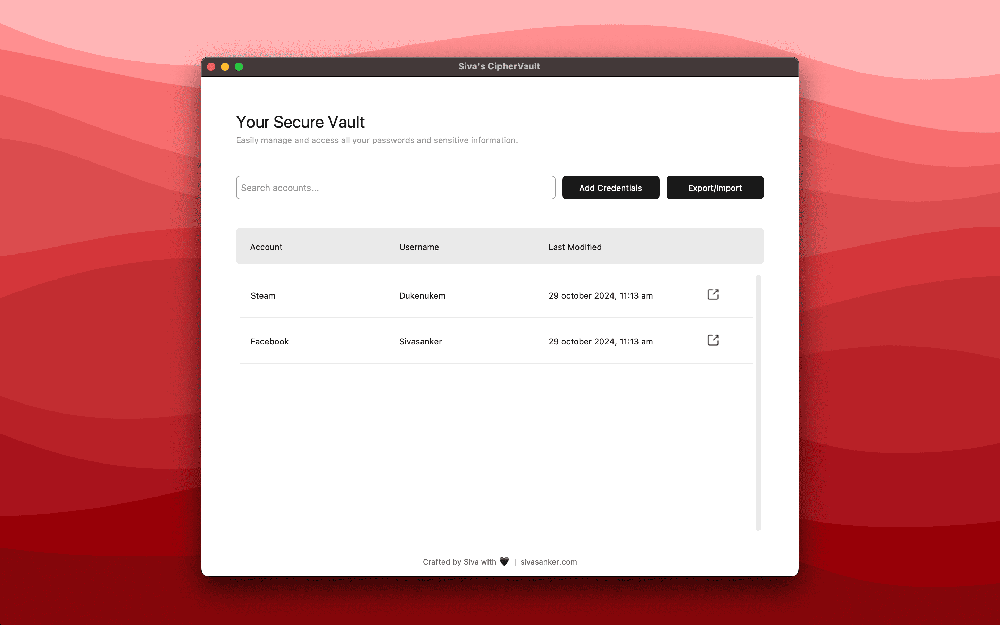
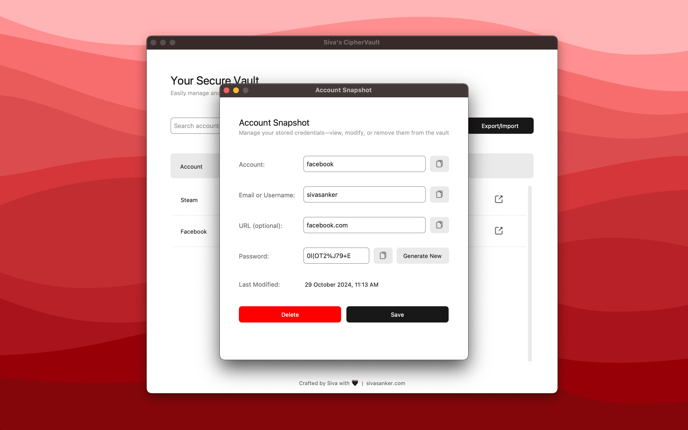
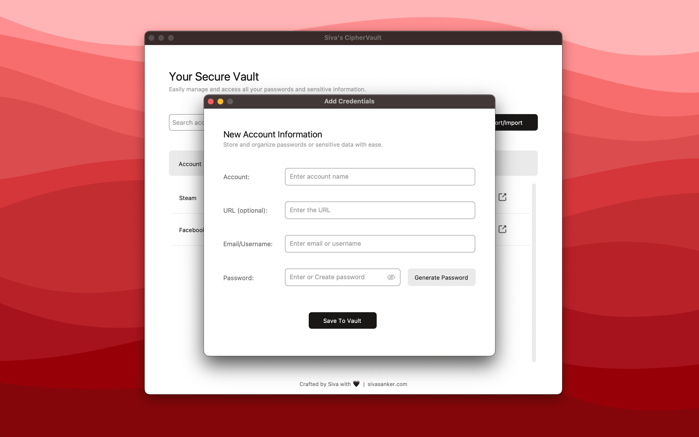
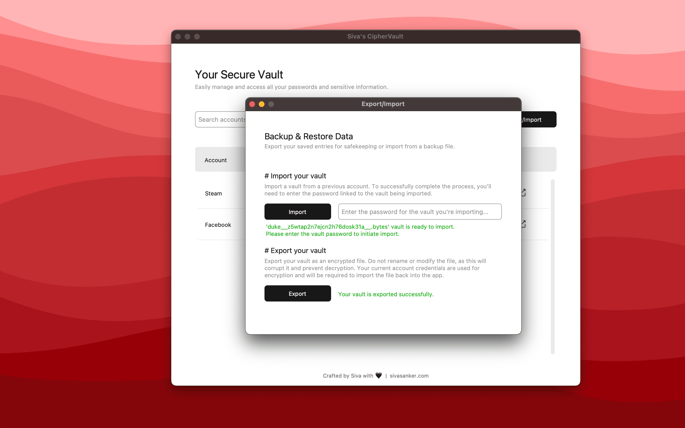

# cipher-vault

A password manager using Tkinter, Pandas, and Fernet encryption/decryption.

### How to run

1. Python used:

   ```bash
   python --version
   Python 3.11.9
   ```

2. Install the packages:

   ```bash
   pip install -r requirements.txt
   ```

3. Execute the main Python script:
   ```bash
   python main.py
   ```

---

<h3 align="center">Authentication</h3>
<p align="center">
  
</p>

<h3 align="center">Home</h3>
<p align="center">
  
</p>

<h3 align="center">Vault edit</h3>
<p align="center">
  
</p>

<h3 align="center">Add account to vault</h3>
<p align="center">
  
</p>

<h3 align="center">Export or import vault</h3>
<p align="center">
  
</p>
